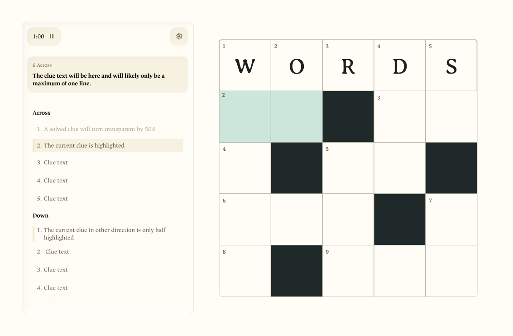
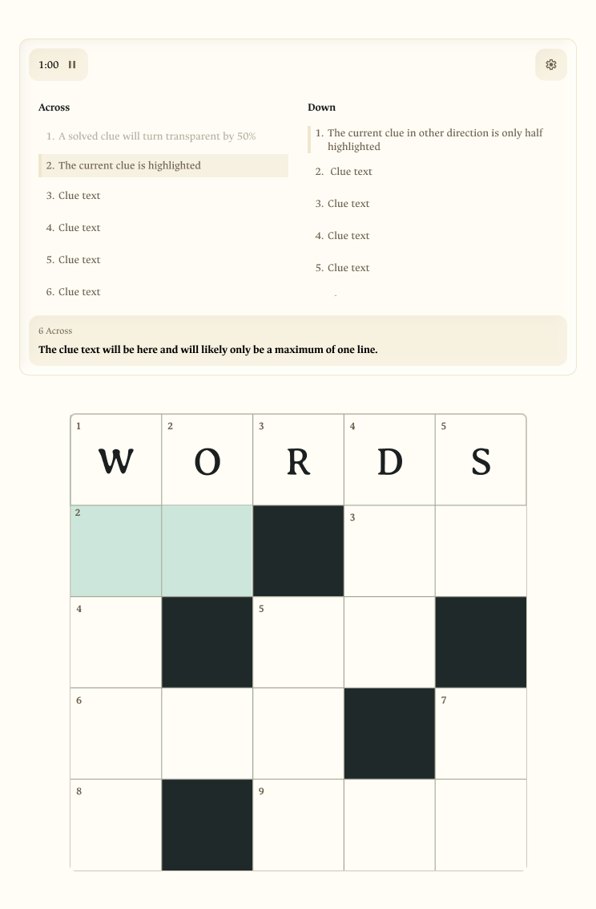

# Crossword Pen

A cozy native SwiftUI iPad crossword app built for Apple Pencil handwriting.

## Overview

Crossword Pen is an iPad-first crossword experience with a calm paper-like interface, responsive portrait and landscape layouts, and direct handwriting input inside the puzzle grid.

## Figma UI

The current Figma UI previews live in `docs/images`.

### Landscape



### Portrait



## What Is Included

- Responsive crossword layout for landscape and portrait iPad use.
- Generated puzzle sizes: `5 x 5`, `10 x 10`, `15 x 15`, and `20 x 20`.
- New puzzle setup popup with size and difficulty choices.
- Apple Pencil writing directly inside each crossword square with PencilKit.
- ML Kit Digital Ink Recognition for turning handwriting into answer letters.
- Across/Down tabs, current clue display, and previous/next clue navigation.
- Gear menu for puzzle actions such as check, restart, new puzzle, and show answers.
- Completion popup for starting another configured puzzle.

## Project Structure

- `crosswordapp/`: SwiftUI app source, puzzle generation, seed puzzle data, and asset catalog.
- `docs/figma/`: Figma-ready UI SVG frames for portrait and landscape.
- `docs/images/`: PNG UI previews used in the README.
- `crosswordapp.xcworkspace`: Xcode workspace with CocoaPods dependencies.

## Open In Xcode

Open `crosswordapp.xcworkspace` in Xcode, choose an iPad simulator or iPad device, and press Run.

If the workspace or ML Kit dependency is missing, install the pods first:

```sh
pod install
```

## Build From Command Line

```sh
xcodebuild -workspace crosswordapp.xcworkspace -scheme crosswordapp -sdk iphonesimulator -derivedDataPath /Users/leiva/crosswordpenapp/DerivedData CODE_SIGNING_ALLOWED=NO build
```

## Notes

- The app is configured as iPad-only with iOS 17.0 as the deployment target.
- CocoaPods provides `GoogleMLKit/DigitalInkRecognition`.
- Bundle identifier: `com.example.leivacrossword`.
